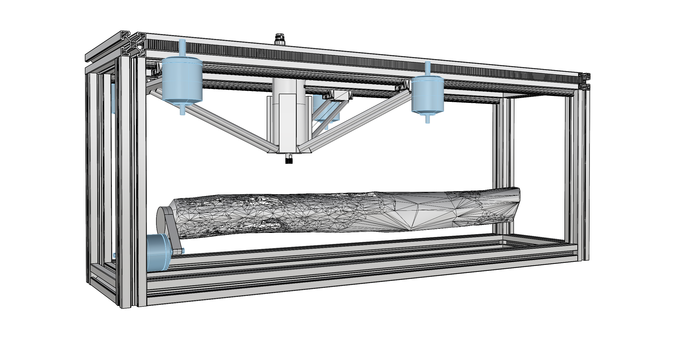

# DeltaCNC

 

> [!NOTE]  
> This repository is a side project (very much on the side, and very much in progress). If by december 2025 there is simething working, it will be positive.
> I do it for two reasons: 1) I want to tinker a bit with ROS2, 2) I want to explore roundwood-specific fabrication technique. 
> Take it as it is 😉
