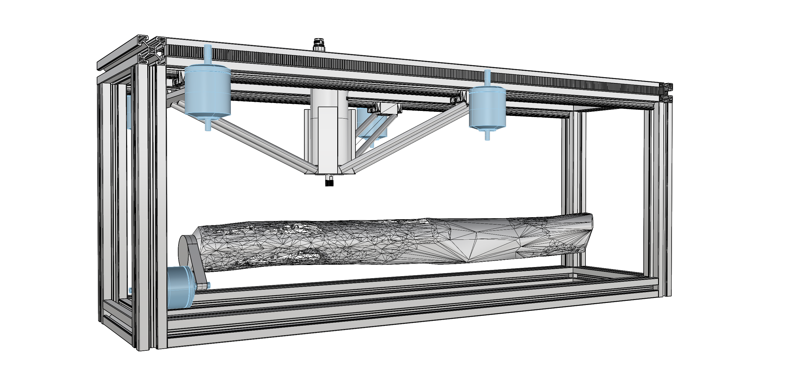
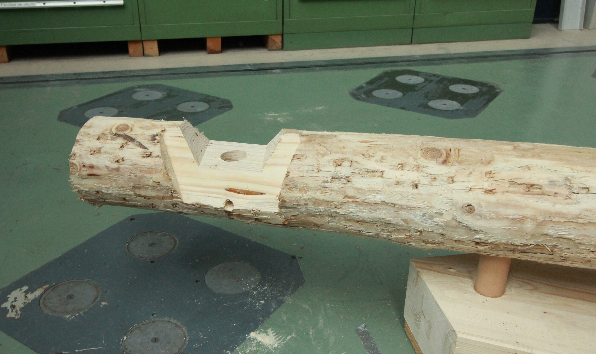
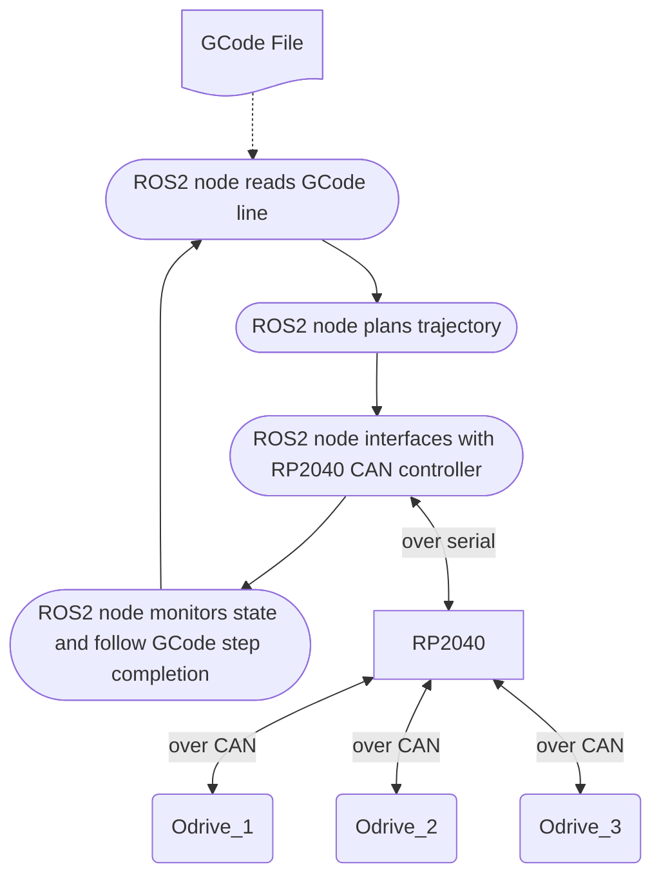

# DeltaCNC

 

> [!NOTE]  
> This repository is a side project (very much on the side, and very much in progress). If by december 2025 there is simething working, it will be positive.
> I do it for two reasons: 1) I want to tinker a bit with ROS2, 2) I want to explore roundwood-specific fabrication technique. 
> Take it as it is 😉

This repo contains an attempt at the analysis of the [kinematics](./kinematics/README.md), and will soon contain the code to run and simulate the CNC with ROS, and at a later stage, it will later contain build documentation (when I win the lottery)

The final goal is to cut joints like this: 

 

### Architecture

The current (and very primitive) architecture is the following:

```mermaid
flowchart
        GCODE@{ shape: doc, label: "GCode File"} -.-> A(["ROS2 node reads GCode line"])
        A --> B(["ROS2 node plans trajectory"])
        B --> C(["ROS2 node interfaces with RP2040 CAN controller"])
        C --> M(["ROS2 node monitors state and follow GCode step completion"])
        M --> A
        C <--"over serial"--> D["RP2040"]
        D <--"over CAN"-->E("Odrive_1")
        D <--"over CAN"-->F("Odrive_2")
        D <--"over CAN"-->G("Odrive_3")
```