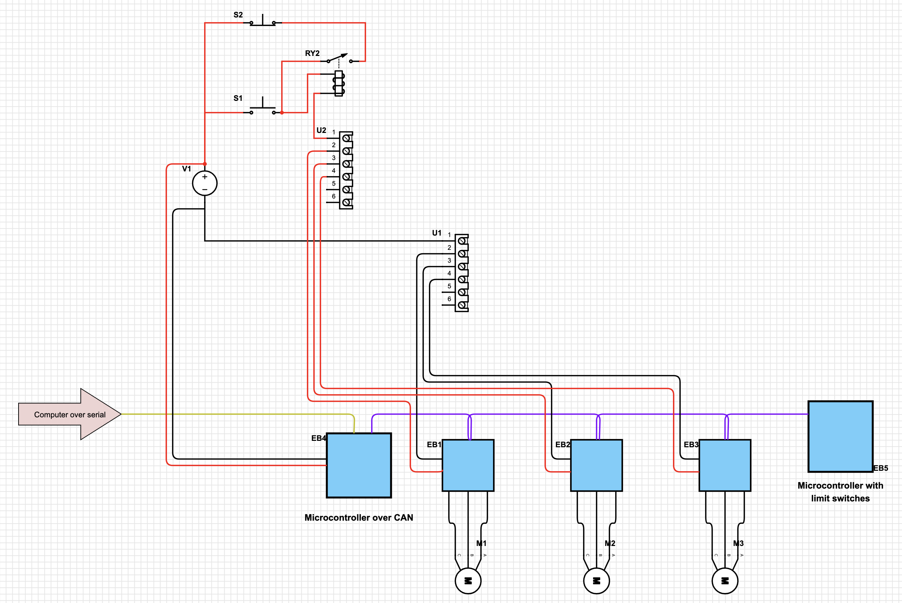

# Electrical schematics

A CNC typically combines 3 types of circuits: 
* High voltage (220V 50Hz, supply from the wall)
* Medium voltage (24-36-48V DC, usually for motors, actuators, sensors...)
* Low voltage (3.3-5V DC, for small controllers)

These circuits should be kept as separated as possible, to avoid electromagnetic interferences (when a current in a cable induces a current in another cable next to it via magnetic inductance)

 