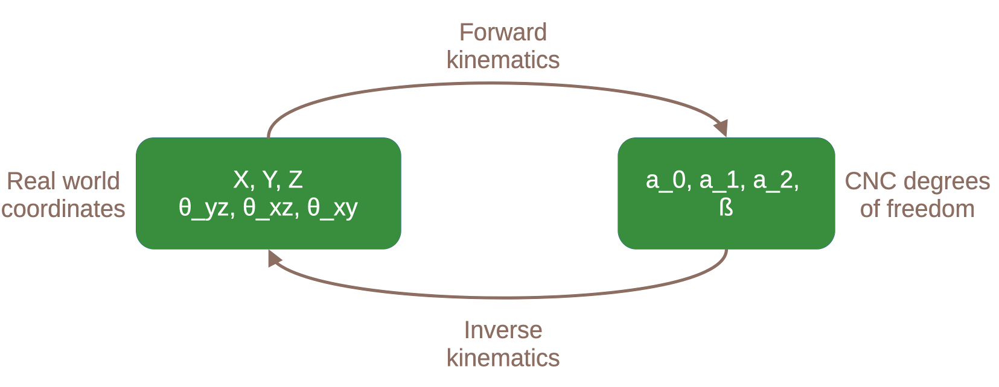
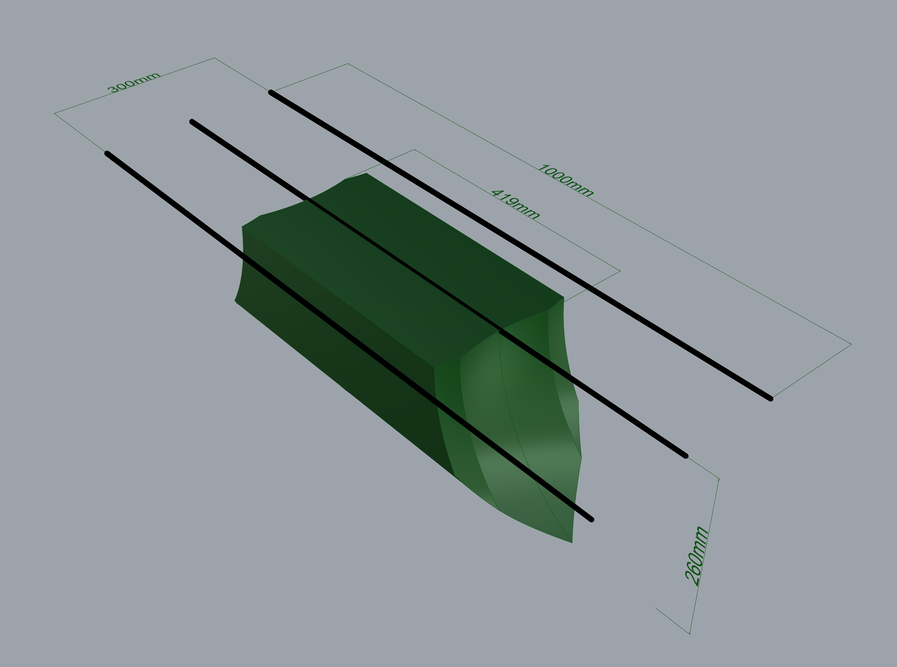

# The kinematics of this CNC 

This folder contains the [forwards kinematics](./forward_kinematics/README.md) and [inverse kinematics](./inverse_kinematics/README.md) models for this CNC

 

Workspace of the CNC with a rail length of 2000mm, rail spacing 100 mm, a link length of 300mm, and a diameter of prindle of 70mm. 

 