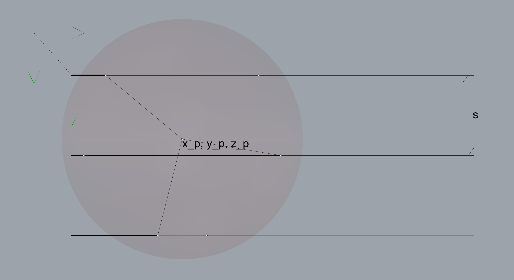
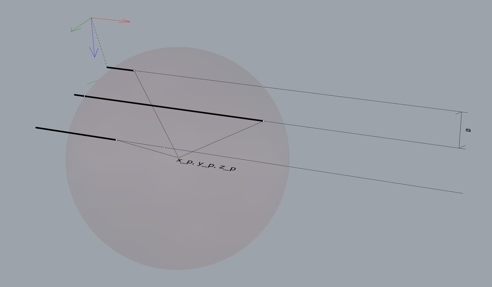

# Forward kinematics

  

For the forward kinematics, we can simply calculate the intersections between the sphere $S$ and the 3 axes that the rails form:

$$ S \equiv (x-x_p)^2 + (y-y_p)^2 + (z-z_p)^2  = R^2 $$

Axis 0:

$$ 
\begin{cases}
z = 0\\
y = 0
\end{cases}
$$

Axis 1:

$$ 
\begin{cases}
z = 0\\
y = s
\end{cases}
$$

Axis 2:

$$ 
\begin{cases}
z = 0\\
y = 2s
\end{cases}
$$

By replacing the $y, z$ coordinates of the sphere equations accordingly, we find:

Axis 0:

$$ (a_0-x_p)^2 + y_p^2 + z_p^2  = R^2 $$

$$ a_o = x_p ±\sqrt{R^2-y_p^2-z_p^2} $$

Similarly, axis 1:

$$ a_1 = x_p ±\sqrt{R^2-(s-y_p)^2-z_p^2} $$

And axis 2:

$$ a_2 = x_p ±\sqrt{R^2-(2s-y_p)^2-z_p^2} $$

We can decide to limit the number of solutions (currently $2^3$) by deciding that $a_1$ sould be on one side of the point $(x_p, y_p, z_p)$ along the x axis, and $a_0$ and $a_2$ on the other side. For example:

$$ a_o = x_p -\sqrt{R^2-y_p^2-z_p^2} $$

$$ a_1 = x_p +\sqrt{R^2-(s-y_p)^2-z_p^2} $$

$$ a_2 = x_p -\sqrt{R^2-(2s-y_p)^2-z_p^2} $$

Those equations imply that not all positions $(x_p, y_p, z_p)$ are possible.

$$ y_p^2+z_p^2 \leq R^2 $$
$$ (s-y_p)^2+z_p^2 \leq R^2 $$
$$ (2s-y_p)^2+z_p^2 \leq R^2 $$