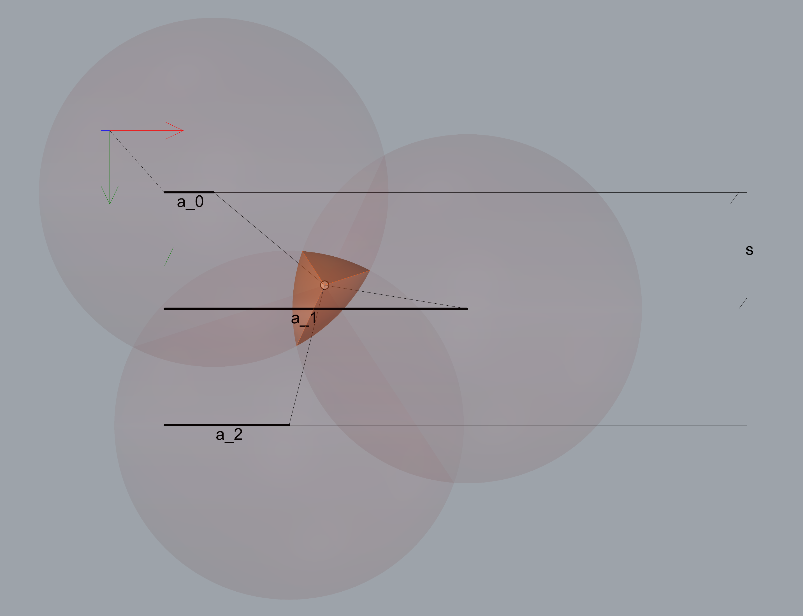
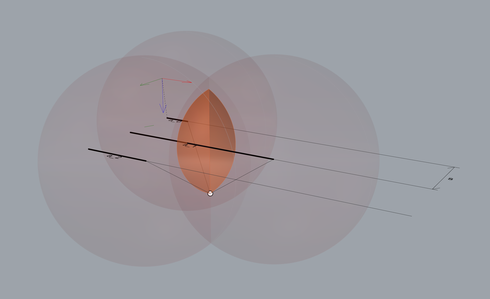

# Inverse kinematics

  

We use a simplified model, the geometry of the tool holder will be taken into account with translations of the x, y, z solution.

Since we have rigid links connected together to one end and each to different carriages on rails to the other end. The solution comes thus as the intersection intersection of three spheres which radii are equal to the linkage lengths.
So we have: 

$$ S_0 \equiv (x-a_0)^2 + y^2 + z^2  = R^2 $$
$$ S_1 \equiv (x-a_1)^2 + (y-s)^2 + z^2  = R^2 $$
$$ S_2 \equiv (x-a_2)^2 + (y-2s)^2 + z^2  = R^2 $$

Because $R^2$ is a constant, we can equate the sphere equations: $S_0 = S_1$. From which we get:

$$ x = \frac{a_0^2-a_1^2-s(s-2y)}{2(a_0-a_1)} $$

Then by using $S_1 = S_2$ and substituting x, we find:

$$ y = \frac{a_0a_2-a_2^2-a_0a_1+a_1a_2-s^2(3+\frac{a_2-a_1}{a_0-a_1})}{-2s(1+\frac{a_2 -a_1}{a_0-a_1})} $$

Then, because the solution must be on all of the three spheres, we can choose any of the three spheres to find the solution for $z$:

$$ solution $$

We can check the solution by setting $a_0 = a_2 = 0$ and $a_1 = s$. Geometrically we can verify that $y = s$, $x = 0$, and $z = \sqrt{R^2-s^2}$. And by setting $a_0 = a_2 = 0$ and $a_1 = s$, we find:

$$ y = \frac{0-0-0+0-4s^2}{-2s(1+1)} = s $$ 

and 

$$ x = \frac{0-s^2-s(-s)}{2(0-s)} = 0 $$

and 

$$ z = \sqrt{R^2-s^2} $$